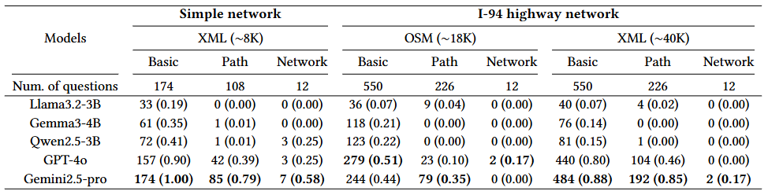

## Abstract

We propose TrafficNetQA, a benchmark to quantitatively evaluate how well Large Language Models (LLMs) understand transportation networks. While there is increasing attention on applying LLMs to traffic operation and management, their ability to reason over structured network data remains underexplored. As LLMs are being positioned as agents in complex decision-making contexts, this understanding becomes increasingly critical. In other words, LLMs are now expected not only to perform task-specific execution, but also to structurally understand road networks as part of their decision-making role.
However, no standard dataset exists to assess this ability. TrafficNetQA bridges this gap through a question answering (QA) dataset covering three areas: basic feature retrieval, pathfinding, and network comprehension. The networks used in our experiments include XML files from the SUMO simulator and OSM files extracted from OpenStreetMap. We benchmarked the zero-shot capabilities of state-of-the-art models including Llama, Gemma, Qwen, GPT, and Gemini, and found clear limitations in their ability to interpret raw network files without explicit guidance. 

## Question sets

- The question sets are organized into three categories: basic feature retrieval, pathfinding, and network comprehension.
- Answers to the questions are provided in the `/QAdataset` folder, organized by file type for easy access.

### Basic feature retrieval

1. What is the id of the from-junction for the edge with id {edge}? <Answer> from: [Your answer]. Do not add any explanation.
1. What is the id of the to-junction for the edge with id {edge}? <Answer> to: [Your answer]. Do not add any explanation.
1. What are the id of the from-junction and to-junction for the edge with id {edge}? <Answer> from: [Your answer], to: [Your answer]. Do not add any explanation.
1. Is the edge with id {edge} a highway? <Answer> Please answer with yes or n'. Do not add any explanation.
1. What is the road type of the edge with id {edge}? <Answer> [Your answer]. Do not add any explanation.
1. How many lanes does the edge with id {edge} have? <Answer> [Your answer]. Do not add any explanation.
1. What are the x, y coordinates of the junction with id {junction}? <Answer> x: [Your answer], y: [Your answer]. Do not add any explanation.
1. Which edges are connected before and after the edge with id {edge}? <Answer> before: [Your answer], after: [Your answer]. Do not add any explanation.

### Pathfinding

1. What are the edge id(s) that come immediately after the edge with id {edge}? <Answer> [Your answer, Your answer, ...]. Do not add any explanation.
1. What are the edge id(s) that can come immediately before the edge with id {edge}? <Answer> [Your answer, Your answer, ...]. Do not add any explanation.
1. What is the shortest path (by length) from the junction with id {junction} to the junction with id {junction}? List the edges in order. <Answer> [Your answer, Your answer, ...]. Do not add any explanation.
1. What is the shortest path (by length) from the junction with id {junction} to the junction with id {junction}? List the edges and junctions in order. <Answer> [edge, - junction, edge, junction, ...]. Do not add any explanation.
1. What is the shortest path distance (by length) from the junction with id {junction} to the junction with id {junction}? <Answer> [Your answer]. Do not add any explanation.
1. Assuming the edge with id {edge} is removed, what is the shortest path (by length) from the junction with id {junction} to the junction with id {junction}? List the edges in order. <Answer> [Your answer, Your answer, ...]. Do not add any explanation.

### Network comprehension

1. List the junctions where the number of lanes decreases when moving from one edge to another. <Answer> [Your answer, Your answer, ...]. Do not add any explanation.
1. List the junctions where the number of lanes increases when moving from one edge to another. <Answer> [Your answer, Your answer, ...]. Do not add any explanation.
1. Considering the entire network, which edges can be regarded as highway entrances — that is, the edges immediately before entering a highway? <Answer> [Your answer, Your answer, ...]. Do not add any explanation.
1. Considering the entire network, which edges can be regarded as highway exits — that is, the edges immediately before leaving a highway? <Answer> [Your answer, Your answer, ...]. Do not add any explanation.
1. How many highway entrance edges are there in the network? <Answer> [Your answer]. Do not add any explanation.
1. How many highway exit edges are there in the network? <Answer> [Your answer]. Do not add any explanation.
1. List the edge pairs where the road speed limit changes when moving from one edge to another. <Answer> [edge1-edge2, edge3-edge4, ...]. Do not add any explanation.
1. List the edges where ramp metering could potentially be installed on the highway. <Answer> [Your answer, Your answer, ...]. Do not add any explanation.
1. List the edges that can be considered as westbound (leftward) highways. <Answer> [Your answer, Your answer, ...]. Do not add any explanation.
1. List the edges that can be considered as eastbound (rightward) highways. <Answer> [Your answer, Your answer, ...]. Do not add any explanation.
1. List the junctions that can be considered as source and sink for vehicle generation based on the terminal ends of roads in the network. <Answer> source: [Your answer, ...], sink: [Your answer, ...]. Do not add any explanation.
1. Assuming terminal junctions in the network are used as sources and sinks, how many possible OD (origin–destination) pairs can be formed? <Answer> [Your answer]. Do not add any explanation.

## Results

